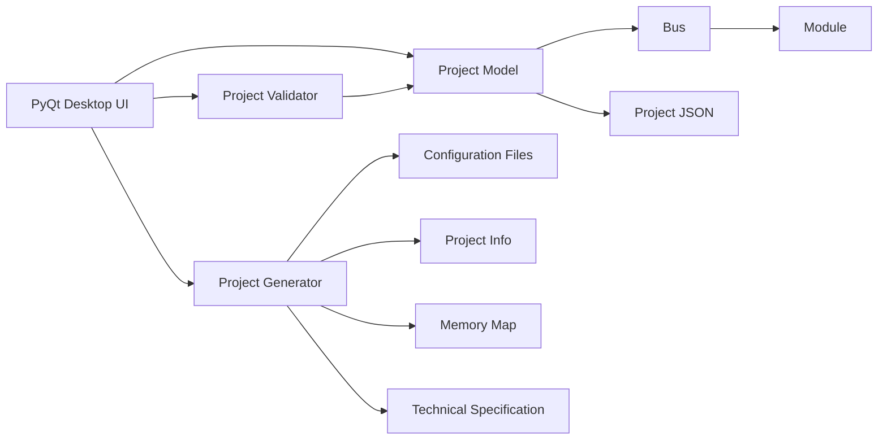

# Architecture

The original commercial application used separate domain entities (`Project`, `Bus`, `Module`) and supporting components for validation, generation, resource management, and specification printing. The public demo keeps only a synthetic version of the domain and generation layers.
